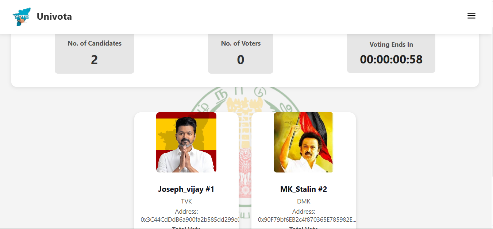

# 🗳️ Univota – Decentralized Voting System


**Univota** is a secure, transparent, and decentralized voting system built using **Blockchain technology**. It ensures fair elections without any central authority. The system is designed with a modern UI inspired by Tamil Nadu government services.

## 🚀 Features

- ✅ Register Candidates & Voters
- 🧾 Display Registered Voters and Candidates
- 🗳️ Cast Votes (One per registered voter)
- 🧮 Live Vote Count
- ⏳ Voting Deadline Countdown
- 🏆 Result Page for Final Outcome
- 🌗 Responsive Design with Light/Dark Theme Toggle
- ⚠️ Real-time Feedback (Success/Error Toasts)

---

## 🛠️ Technologies Used

| Layer     | Tech Stack                    |
|-----------|-------------------------------|
| Frontend  | ReactJS, Tailwind CSS         |
| Blockchain| Solidity, Ethers.js           |
| Tools     | Hardhat, IPFS (via Pinata)    |

---

## 📸 Screenshots

> 🖼️ Homepage  
(Add more screenshots here as needed)
> 

---

---

## ⚙️ Installation & Setup

1. **Clone the repository**

   ```bash
   git clone https://github.com/Naveen-nsd-2003/Univota.git
   cd Univota
2. **Install Dependencies**
   ```bash

    npm install

3. **Start the App**
   ```bash
    npm run dev

4. **Start HardhatBlockchain**
   ```bash
    npx hardhat node

5. **Deploy smart Contract**
    ```bash
     npx hardhat run scripts/deploy.js --network localhost


🙋‍♂️ Author
Naveen Kumar N
📧 naveennsd1515@gmail.com
🔗 GitHub – @Naveen-nsd-2003
